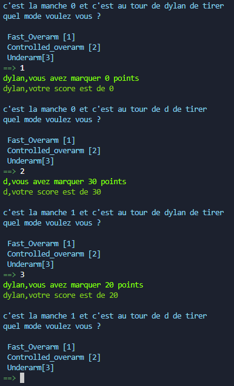
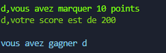

# projet bullseye

## type de donnés

### dictionaire

-pour le tableau des score nous avons utiliser un dictionnaire

```python

{
  "dylan": "20",
  "schertzer": "180",
}

```

### entier

- pour le score nous avons utiliser des entier

## l'algorithme

- nous avons generer un nombre aleatoire entre 0 et 1 et en fonction de ce nombre nous avons attribuer un score a l'utilisateur

```
    on genere un nombre aleatoire entre 0 et 1
    si le nombre est inferieur a 0.5 on renvoie 0
    si le nombre est entre 0.5 et 0.55 on renvoie 20
    si le nombre est entre 0.55 et 0.65 on renvoie 30
    si le nombre est superieur a 0.65 on renvoie 40
```

## les fonctions

### la fonction mode de tir

- une fonction qui vas demander a l'utilisateur de choisir un mode de tir et renvoie le score du tir par rapport a l'algorithme de tir

```python
def mode_de_tir():
    demande a l'utilisateur de choisir un mode de tir
    renvoie le score du tir
```

### la fonction pour crée le dico des score

- une fonction qui vas crée un dictionnaire avec les nom des joueur et leur score en fonction des entrer de l'utilisateur

```python
def dico_score():
    demande le nombre de joueur
    renvoie un dictionnaire avec les nom des joueur et leur score initialiser a 0
```

### tour du jeu

- une fonction qui vas gerer le tour du jeu en fonction du dico des score jusqua que le score d'un joueur soit egale ou superieur a 200

```python

def tour_du_jeu():
   regarde le dico des score
    demande a l'utilisateur de choisir un mode de tir
    ajoute le score du tir au score du joueur
    affiche le score du joueur
    regarde si le score du joueur est superieur ou egale a 200
    si oui affiche le nom du joueur qui a gagner
    sinon retour au debut de la fonction


```

### la fonction main

- une fonction qui vas gerer le jeu en fonction des autres fonctions

```python
def  main():
    mets le dico des score dans une variable
    lance la fonction tour_du_jeu avec le dico des score en parametre

```

## interface utilisateur

- entrer du jeu


- tour de jeu



- fin du jeu




## probleme rencontré

- nous avons dabord pas reussi a gerer le dico des score
- les entrer de l'utilisateur n'etait pas gerer
- l'algorithme de tir n'etait pas gerer proprement
- les probalite etaient fausse


